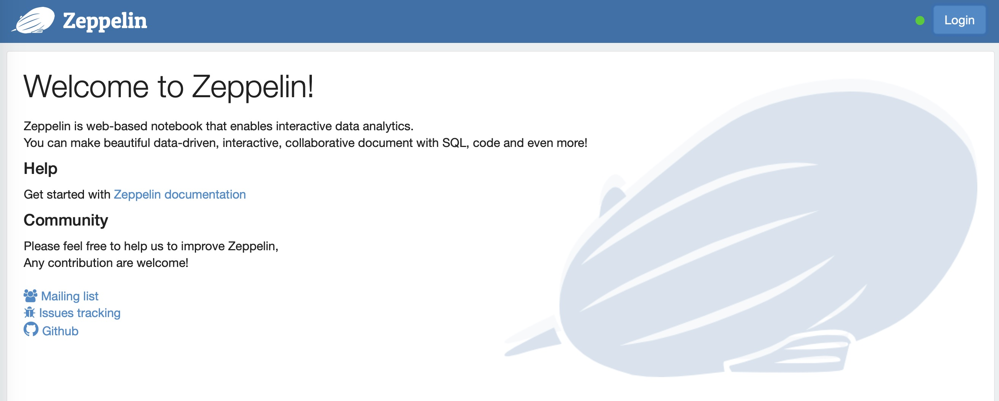
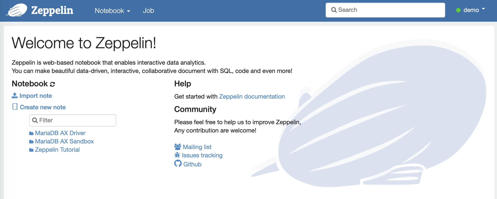

# MariaDB AX Columnstore Sandbox with Zeppelin Notebooks

<!-- @import "[TOC]" {cmd="toc" depthFrom=1 depthTo=6 orderedList=false} -->

<!-- code_chunk_output -->

* [MariaDB AX Columnstore Sandbox with Zeppelin Notebooks](#mariadb-ax-columnstore-sandbox-with-zeppelin-notebooks)
	* [Installing prerequisites](#installing-prerequisites)
		* [Install Docker](#install-docker)
		* [Install Docker Compose](#install-docker-compose)
		* [Get the MariaDB AX sandbox](#get-the-mariadb-ax-sandbox)
		* [System Requirements](#system-requirements)
		* [Build columnstore](#build-columnstore)
		* [Build Zeppelin instance (optional)](#build-zeppelin-instance-optional)
		* [Bring the whole cluster up](#bring-the-whole-cluster-up)
		* [Troubleshooting](#troubleshooting)
	* [Zeppelin Guide](#zeppelin-guide)
		* [What is Zeppelin](#what-is-zeppelin)
		* [Start MariaDB AX Sandbox - Bookstore Analytics](#start-mariadb-ax-sandbox-bookstore-analytics)
	* [Useful Links](#useful-links)

<!-- /code_chunk_output -->

## Installing prerequisites

### Install Docker

* Install docker following this link:

https://docs.docker.com/engine/installation/

### Install Docker Compose

* Install docker compose following this link:

https://docs.docker.com/compose/install/

### Get the MariaDB AX sandbox

Checkout the images from [GitHub](https://github.com/mariadb-corporation/mariadb-columnstore-docker)

```bash
cd /working_directory
git clone https://github.com/mariadb-corporation/mariadb-columnstore-docker.git
```

### System Requirements

The docker application should run with *minimum 4GB RAM* allocated for those 5 machines to spin and work properly.
The disk space requirement for the docker images is around 4GB.

Make sure you are in columnstore_zeppelin folder

### Build columnstore

Navigate to the columnstore directory.

```bash
cd columnstore_zeppelin
```

```bash
docker build -t mariadb/columnstore:1.2 ../columnstore
```

### Build Zeppelin instance (optional)

```bash
docker build -t mariadb/columnstore_zeppelin:latest ../columnstore_zeppelin
```

### Bring the whole cluster up

The command is starting a columnstore cluster with 4 nodes 2UM and 2PM modules:

```bash
docker-compose up --build
```

It can take up to 10 min before the cluster starts and the data is ingested.

The following log entry marks the end of the load. 
**`"Container initialization complete at ..."`**

The status of data ingest can be tracked in the UM1 container log file.

```bash
docker logs -f columnstore_zeppelin_um1_1
```

The Bookstore Sandbox Database can be accessed directly with following command:
```bash
mysql -h127.0.0.1 -uzeppelin_user -pzeppelin_pass bookstore
```

### Troubleshooting

In case you run a service on 3306,3307 or 8080 the ports configuration in docker-compose.yml should be changed.
You might encounter the following error
`ERROR: Encountered errors while bringing up the project.`

i.e. if we have another MariaDB server running on port 3306 
The following configuration

```yaml
    ports:
      - "3306:3306"
```

Should be altered like this:

```yaml
    ports:
      - "3308:3306"
```

Assuming 3308 is unbound on our machine.

In case Zeppelin some notebook queries do not work: Increase the memory allocation of the docker engine. The setup  was tested with 4GB RAM but for some operations systems this might be insufficient. 

## Zeppelin Guide

### What is Zeppelin

A open web-based notebook that enables interactive data analytics

Apache Zeppelin brings data ingestion, data exploration, visualization, sharing and collaboration features to Hadoop and Spark.

Zeppelin allows data engineers, data scientist and data analysts be more productive by developing, organizing, executing, and sharing data code and visualizing results without referring to the command line or needing the cluster details.
Notebooks allow these users not only to execute but to interactively work with long workflows.  

We use Zeppelin to allow data scientists to play with the sandbox data stored in MariaDB AX cluster.

### Start MariaDB AX Sandbox - Bookstore Analytics

After the installation is completed you can navigate to [http://localhost:8080/](http://localhost:8080/) and will be presented with the Zeppelin home page



In the lower right section is the Notebook section. There you can find **MariaDB AX Sandbox Folder**
Click top open.


Choose **Bookstore Analytics with Scala and Spark**



When you open iot for first time you will be presented with the interpreter bindings.
Press **Save** to save those bindings.


You are ready to us Zeppelin with MAriaDB AX Sandbox Data

You can follow this link to get more information about the [Zeppelin user interface](https://zeppelin.apache.org/docs/0.8.0/quickstart/explore_ui.html#note-layout).

You can start with "Run All Paragraphs" ...

after confirmation  all scripts will be executed and the results presented.


You can also follow the tutorial and run the individual paragraphs one by one pressing  on each paragraph.

Follow the screen instructions.

## Useful Links
[Docker Commands](https://docs.docker.com/engine/reference/commandline/cli/)
[Docker Compose Commands](https://docs.docker.com/compose/reference/overview/)
[Zeppelin UI Guide](https://zeppelin.apache.org/docs/0.8.0/quickstart/explore_ui.html)
[Zeppelin Tutorial](https://zeppelin.apache.org/docs/0.8.0/quickstart/tutorial.html)
[Zeppelin with MariaDB and JDBC](https://zeppelin.apache.org/docs/0.8.0/interpreter/jdbc.html#mariadb)
